# Probes — A Theory & Picture Book

A knowledge-dense reference for every probe in the Decision Boundary Playground. Each probe gets: the mathematical equation, the geometric intuition, a worked figure, when it gives a clean signal, when it lies, and what our experiments told us about it.

**Read this when** you need to understand *why* a probe gave a certain number, *which* probe to use for a new question, or *how* two probes can disagree.

**Companion documents:**
- `docs/PROBES.md` — Quick-reference index (same probes, less depth, no figures).
- `docs/THEORY.md` — The five-step causal chain from batch size to brittleness.
- `docs/PAPERS.md` — The canonical paper grounding each dial.

All figures in this document were generated by `scripts/generate_probe_figures.py`. They use 2D synthetic data (two-moons) wherever possible, so the decision boundary, gradients, and perturbations are *literally drawable*. Real CIFAR / ResNet behaviour is the same mathematics in higher dimensions — but the 2D analogue is what builds intuition.

---

## 0. What are we even measuring?

A trained model `f(x)` partitions input space into regions, one per class. The set of points where the model is undecided between two classes is the **decision boundary**.

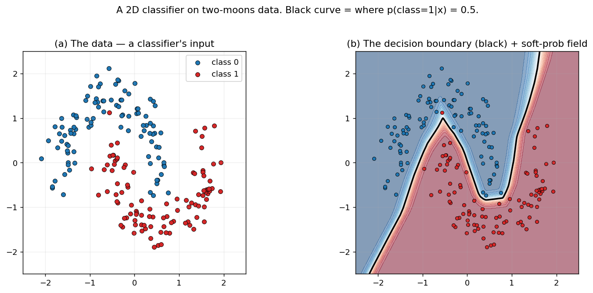

**Panel (a)** shows the raw data — two interleaved half-moons, blue vs red. **Panel (b)** shows the same data plus what an MLP learned: the soft probability field (light blue → dark red) and the black curve where `p(class = 1 | x) = 0.5`. That black curve **is** the decision boundary. Brittleness is the question:

> *How close, in some meaningful sense, is each data point to that black curve?*

There are two ways "close" can be measured, and probes split along this divide:

| Space | What lives here | "Sharp" means |
|---|---|---|
| **Parameter space** (`Θ ⊂ R^|θ|`) | The trained weights `θ*` | The loss `L(θ)` has high curvature at `θ*` — a small *weight* nudge makes loss spike |
| **Input space** (`X ⊂ R^d`) | The data `x` | The function `f` has high slope near data — a small *input* nudge makes logits spike, flipping predictions |

These two spaces are connected but *not identical*. **The most important caveat in this entire document**: a probe that measures one does not automatically measure the other (see §9, Cross-Probe Agreement).

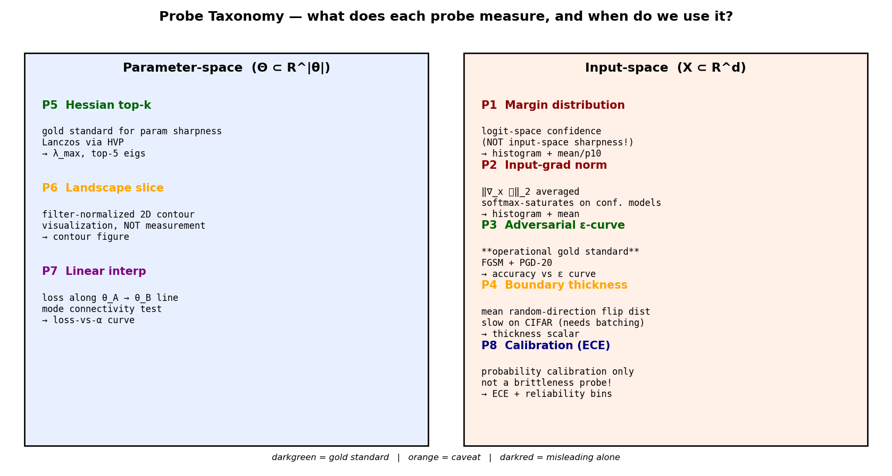

The big map. Use it as a decision sheet: "I want X → which probe?"

---

## 1. P1 — Margin Distribution

**Equation:**

```
m(x, y) = f(x)_y − max_{j ≠ y} f(x)_j
```

- `f(x)_y` is the logit (pre-softmax score) of the **true** class for input `x`.
- `max_{j ≠ y} f(x)_j` is the **highest competing logit**.
- `m > 0` ⟺ the model picked the right class.
- `|m|` measures *how confidently* the model picked, in logit units.

We compute `m` for every test point and report `(mean, p10, p50, p90, frac_negative, full_histogram)`.

### Implementation trick

To get "max over classes **other than** `y`" in one pass, we replace the true-class entry with `-∞` then take a normal max:

```python
masked = logits.clone()
masked.scatter_(1, y.unsqueeze(1), float("-inf"))
max_other, _ = masked.max(dim=1)
margin = logits.gather(1, y.unsqueeze(1)).squeeze(1) - max_other
```

### The picture

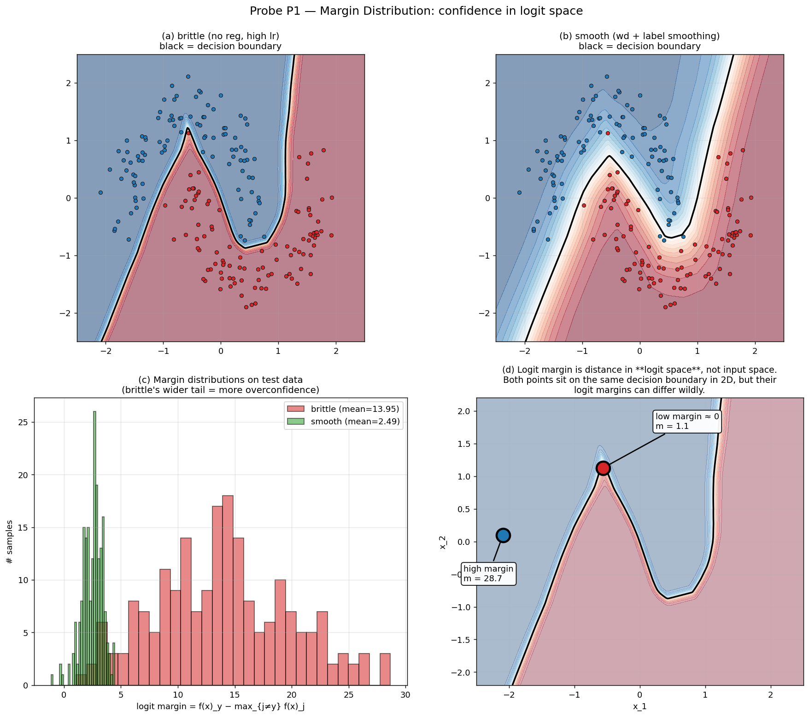

- **(a)** A brittle model (no regularization, high LR) draws a decision boundary that is *intricate* — many bends through the noisy region. Most points lie far from the boundary in logit space.
- **(b)** A smooth model (weight decay + label smoothing) draws a simpler boundary.
- **(c)** Histograms of the margin values. Note: brittle's distribution extends well beyond 20, while smooth's centres around 2-3. Smooth produces *smaller* margins because label smoothing caps the maximum logit gap by construction.
- **(d)** The key geometric point: **margin lives in logit space, not input space**. Two points sitting on the *same decision boundary in 2D* can have wildly different logit margins. The big-margin point has `m = 28.7`; the small-margin point has `m = 1.1`. The model is more "confident" about one than the other, *despite* both being right at the boundary in input space.

### Why P1 alone is misleading

Think of `f(x) = Wx`. If you scale `W` by 10, every logit (and every margin) scales by 10 too — but the decision boundary in input space is **identical**. So large margin can mean either "model is far from the boundary in input space" OR "model just has large weights." These aren't the same thing.

### When P1 gives clean signal

- Comparing calibration between models with the **same weight scale**.
- Detecting **overconfidence** (large positive margin paired with low ECE).

### When P1 lies

- As an input-space brittleness probe. Use P3 (adversarial ε) for that.
- Across models with different label smoothing — smoothing artificially caps margin.

### What our experiments said

| Experiment | bs | margin mean | robust@8/255 |
|---|---:|---:|---:|
| Exp 1 (PreActResNet-20, 20 ep) | 32 | 4.99 | 1.4 % |
| Exp 1 | 8192 | 0.60 | 17.7 % |
| Exp 2 (SmallCNN, 100 ep) | 256 | 16.8 | 8.4 % |
| Exp 2 | 5000 | 5.9 | 0.9 % |

**Exp 1: high margin → worse robustness.** Exp 2: high margin → better robustness. They disagree, because margin is just measuring confidence under whatever weight scale the optimizer happened to produce. P1 is descriptive, not diagnostic for brittleness.

---

## 2. P2 — Input-Gradient Norm

**Equation:**

```
g(x, y) = ‖∇_x ℓ(f(x), y)‖_2
```

The L2 norm of the **cross-entropy loss** gradient w.r.t. the **input** `x`. Computed by setting `x.requires_grad_(True)` and calling `torch.autograd.grad(loss, x)`.

### Intuition (and where it goes wrong)

The naïve story is: "if `‖∇_x ℓ‖` is large, a tiny input nudge makes loss spike → brittle." Half right.

The other half — the part most explanations skip — is **softmax saturation**:

```
∂ℓ / ∂logit_y = softmax_y − 1
```

When the model is confidently right (`softmax_y ≈ 1`), this derivative is ≈ 0. So even if the **logit** gradient `∂f/∂x` is huge, the **loss** gradient is suppressed. P2 measures loss-grad, not logit-grad.

### The picture

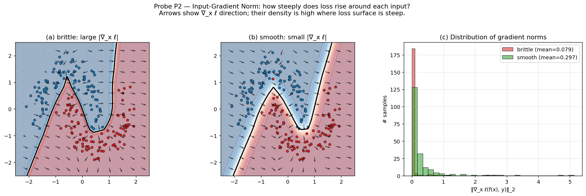

- **(a)** Brittle model: gradient arrows are dense and large all around the decision boundary — the loss surface rises steeply in input space.
- **(b)** Smooth model: gradient field is shorter and more diffuse. But notice — and this matters — the gradient norms aren't always smaller for the smooth model. In fact in the histograms (panel c), the smooth model often has a **larger** mean gradient norm. That's the softmax saturation paradox: brittle's overconfident softmax suppresses its own loss gradient.

### When P2 gives clean signal

- On poorly-fit or partially-trained models where softmax hasn't saturated.
- Comparing models at the **same level of confidence**.

### When P2 lies

- On well-trained, confident models — gradients vanish across the board. From Exp 1's MNIST demo:

| Recipe | grad-norm mean | robust@ε=0.2 |
|---|---:|---:|
| brittle | 0.108 | 43.2 % |
| smooth | 0.132 | 58.2 % |

The smoother (and more robust!) model has the *larger* gradient norm. P2 disagrees with P3.

### The fix (Side fix E in our backlog)

Replace the loss gradient with the **margin gradient**:

```
g'(x, y) = ‖∇_x m(x, y)‖_2 = ‖∇_x [f(x)_y − max_{j≠y} f(x)_j]‖_2
```

The margin is unbounded above, so it doesn't saturate. The gradient of margin is then a clean input-space steepness measure.

---

## 3. P3 — Adversarial ε-Curve (FGSM + PGD)

**Equation:** Find the worst perturbation inside an ε-ball, then check accuracy:

```
δ*(x, y, ε) = argmax_{‖δ‖_∞ ≤ ε}  ℓ(f(x + δ), y)
accuracy(ε) = mean over (x, y) of  [ argmax f(x + δ*) == y ]
```

We compute `accuracy(ε)` for a list of `ε` values. The output curve is the operational brittleness signature.

### Two attacks

| Attack | Update rule | Strength | Cost |
|---|---|---|---|
| **FGSM** (Goodfellow 2015) | `δ = ε · sign(∇_x ℓ)` — one step | weak | 1 fwd + 1 bwd |
| **PGD-k** (Madry 2018) | `δ ← clip(δ + α · sign(∇_x ℓ), [-ε, +ε])` × `k` iterations | strong | `k` fwd-bwd passes |

PGD is what we use by default (k=20, α=ε/4). FGSM is a useful cheap cross-check, but never the final answer — a model that resists FGSM but falls to PGD has not been robustly trained, it has been **obfuscated**.

### The picture

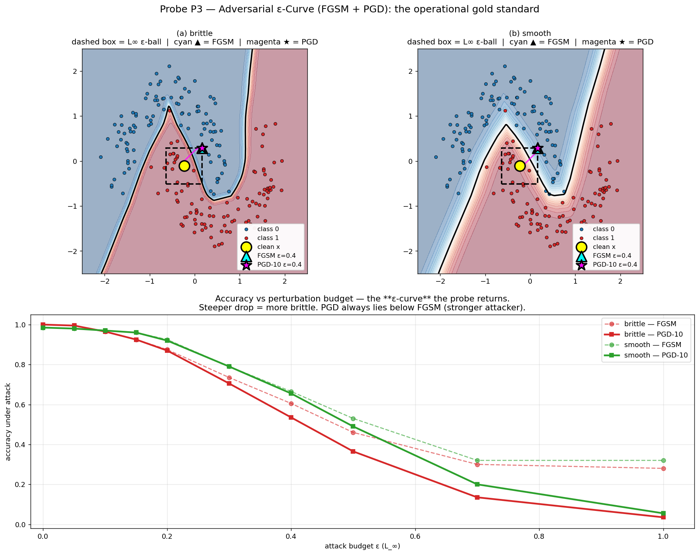

- **(a, b)** A single sample (yellow) at coordinates roughly (0.1, 0.5). The dashed black square is the **ε-ball** under L∞ — the attacker is allowed to move within this box. The cyan triangle is where FGSM lands (one step in the gradient-sign direction). The magenta star is where PGD-10 ends up after iteratively maximizing loss. In the brittle model, PGD finds the boundary easily; in the smooth model, even PGD's worst-case point inside the ε-ball stays on the correct side.
- **Bottom**: the accuracy-vs-ε curves are the standard probe output. Both attacks drop accuracy as ε grows, but **PGD always lies below FGSM** because PGD is a stronger attacker. The vertical gap between two recipes at a fixed ε is the operational brittleness measurement.

### Why P3 is the operational gold standard

- Directly answers "will a small input perturbation flip the prediction?" — the threat-model question.
- Doesn't depend on weight scale (unlike P1) or softmax saturation (unlike P2).
- Reports a curve, not a scalar — you see the full robustness profile at once.

### When P3 lies

P3 doesn't really lie — it answers exactly the question it asks. The trap is **interpretation**:

- **At extreme batch sizes / underfit models**, a "robust" model is just untrained. From Exp 1: bs=8192 had 17.7% robust accuracy *because* clean accuracy was only 61.6% — there was nothing left to attack. Always compare via the **fragility ratio** `(clean − robust) / clean`, not raw robust accuracy.
- **Wrong ε scale**. ε is in the input space the model sees (post-normalization). If the data is normalized with σ ≈ 0.25, raw `ε = 8/255 ≈ 0.031` becomes `≈ 0.124` in normalized units. Don't compare numbers across papers without checking this.

### Our experiments

From Exp 2 (Welch's t-test, 3 seeds):

```
bs=256:  robust@8/255 = 0.084 ± 0.007
bs=5000: robust@8/255 = 0.009 ± 0.003
t = 17.41,  p = 0.0008  →  significant
```

A 9.4× ratio. P3 is the cleanest cross-experiment metric we have.

---

## 4. P4 — Boundary Thickness

**Equation:** For each sample `x` with predicted class `y_pred`, walk along random directions until the prediction flips:

```
t*_i(x) = min { t > 0 :  argmax f(x + t · d_i)  ≠  y_pred }
thickness(x) = (1 / N_directions) · Σ_i  min(t*_i, max_steps · step)
```

The clamp at the end is a *floor*: if no flip is found within `max_steps`, we still record a finite value.

### The picture

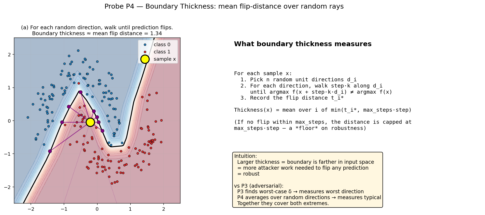

Pick a sample point (yellow). Draw `N_directions` rays from it. For each ray, walk in fixed `step` increments until the model's prediction changes class. Mark the flip point (purple dot). The mean over rays is the *boundary thickness* for that sample.

Geometrically: P4 measures the **average** input-space distance to the nearest boundary, while P3 measures the **worst-case** distance an attacker can find. Together they cover the geometry from both ends — typical robustness (P4) and adversarial worst case (P3).

### When P4 gives clean signal

- For models where you want a non-worst-case robustness measure.
- For comparing two recipes at the *same* dataset and architecture.

### When P4 fails

- **Currently broken on CIFAR-scale models**. The probe iterates one sample at a time, one direction at a time, one step at a time:

  ```
  ops = N_test × N_directions × max_steps × forward_pass_cost
      = 10000 × 16 × 64 × (PreActResNet-20 forward)
      ≈ 10.2 million sequential forward passes
  ```

  At ~5 ms per single-sample forward on an A10, that's ~14 hours per call. **The probe hung in Exp 1 and is currently disabled in the executor** (`playground/sweep/executor.py:60`).

- **Configuration sensitivity**. The default `step=0.05, max_steps=10` caps thickness at 0.5. From our MNIST demo (Exp 1):

  | Recipe | thickness |
  |---|---:|
  | brittle | 0.4999 ± 0.0000 |
  | smooth | 0.4999 ± 0.0001 |

  Both saturated. The probe gave no signal because the cap was below the actual flip distance.

### The fix (Side fix A in our backlog)

Batch over samples. Instead of N_test sequential forwards per (direction, step) pair, do one batched forward of size N_test:

```python
for direction_idx in range(N_directions):
    direction = random_unit_vector()  # shape (1, *input_shape)
    for step_idx in range(max_steps):
        x_perturbed = x_batch + step_idx * step * direction
        new_preds = model(x_perturbed).argmax(1)
        # for each sample, record first step where new != original
```

Should bring CIFAR-scale runtime from 14 hours to ~5 min.

---

## 5. P5 — Hessian Top-k Eigenvalues (parameter-space gold standard)

**Equation:** The Hessian of the loss at the trained parameters:

```
H_{ij} = ∂² L(θ) / (∂θ_i ∂θ_j)   evaluated at  θ = θ*
```

For a network with `N` parameters, `H` is `N × N`. For SmallCNN, N ≈ 10⁵; for ResNets, N ≈ 10⁶ to 10⁸. **We cannot materialize H.** What we *can* compute is `H · v` for any vector `v`.

### The Pearlmutter (1994) trick

Compute the gradient as a function of `θ`. Take the dot product with `v`. Differentiate **again** with respect to `θ`:

```
1.   g = ∇_θ L(θ)                  # one backward pass, with create_graph=True
2.   d = g · v                     # scalar — just a dot product
3.   H · v = ∇_θ d                 # second backward pass
```

Two backward passes give you any Hessian-vector product — no matrix ever stored. This is what `playground/probes/hessian.py` does.

Then **Lanczos** (via `scipy.sparse.linalg.eigsh` wrapped around a `LinearOperator` that does HVP for us) finds the top-k eigenvalues in ~50-100 matvecs. Total: a few minutes per probe call.

### Why we care about λ_max

A loss minimum is locally quadratic:

```
L(θ* + Δθ) ≈ L(θ*) + (1/2) · Δθ^T H Δθ
```

Along the **top eigenvector** of `H`, this becomes `L(θ* + t·v_max) ≈ L_min + (1/2)·λ_max·t²` — a 1D parabola whose curvature is `λ_max`. **Big λ_max = narrow basin = "sharp" minimum** in the Keskar 2017 sense.

### The picture

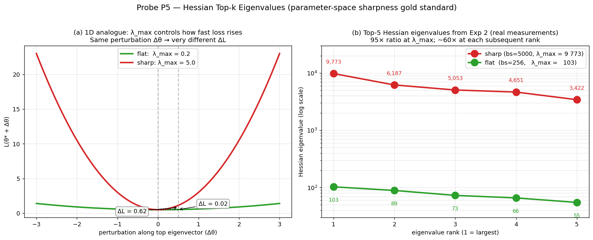

- **(a)** The 1D analogue. Two quadratics with `λ = 0.2` (flat, green) and `λ = 5.0` (sharp, red). The **same** parameter perturbation `Δθ = 0.5` produces `ΔL = 0.02` for the flat minimum but `ΔL = 0.62` for the sharp one. λ_max literally controls how fast you fall off the minimum.
- **(b)** Real top-5 Hessian eigenvalues from Exp 2 (SmallCNN, CIFAR-10, 100 epochs). The bs=5000 model has every one of its top 5 eigenvalues about **50-100× larger** than the bs=256 model. λ_max ratio: **95×**. The sharp basin is dramatically sharper across the entire top of the spectrum, not just along one direction.

### When P5 gives clean signal

- For **converged** models (gradient at θ* is near zero, so quadratic approximation is valid).
- When comparing recipes at **similar loss values** — comparing a converged and an underfit model's curvatures isn't well-defined.

### When P5 lies (or rather: when it's hard to interpret)

- For **underfit** models, the Hessian at a non-minimum is just local geometry, not basin shape.
- **Reparameterization** (Dinh 2017): rescale layer L by α, layer L+1 by 1/α. The function is identical, but H's eigenvalues can change arbitrarily. So λ_max isn't a function-space invariant — it's coordinate-dependent.
- **Spectrum bias**: HVP averages over a fixed set of batches; if those batches are atypical, λ_max is biased. We use `max_batches=8` for stability.

### Our experiments

From Exp 2 (deep-probe cells only — λ_max is expensive):

| bs | λ_max | top-5 |
|---|---:|---|
| 256 | **103** | [103, 89, 73, 66, 55] |
| 5000 | **9 773** | [9 773, 6 187, 5 053, 4 651, 3 422] |

The single cleanest piece of evidence we have for "sharp vs flat" in this playground.

---

## 6. P6 — Filter-Normalized Loss Landscape Slice

**Equation:** Generate two random parameter-space directions `d1, d2`, evaluate the loss on a 2D grid:

```
L_grid[i, j] = L( θ* + α_i · d1 + β_j · d2 )
α_i, β_j ∈ [−span, +span]   with grid_size points each
```

### The filter-normalization trick (Li 2018)

A naïve random direction in parameter space is dominated by whichever weight tensor has the largest norm. Li 2018's fix: for each weight tensor `W`, rescale the corresponding direction tensor `d` so each *filter* (output channel) of `d` has the same Frobenius norm as the corresponding filter of `W`:

```python
# For a conv layer with shape (C_out, C_in, k, k):
W_filter_norm = ‖W[c, :, :, :]‖_F   # per output channel c
d_filter_norm = ‖d[c, :, :, :]‖_F
d_normalized[c] = d[c] * (W_filter_norm / d_filter_norm)
```

The goal of this normalization is to make landscape plots comparable **across different architectures**. As a side effect it can also *mask* sharpness differences between two recipes on the *same* architecture — see §6 caveats.

### The picture (and the visualization trap)

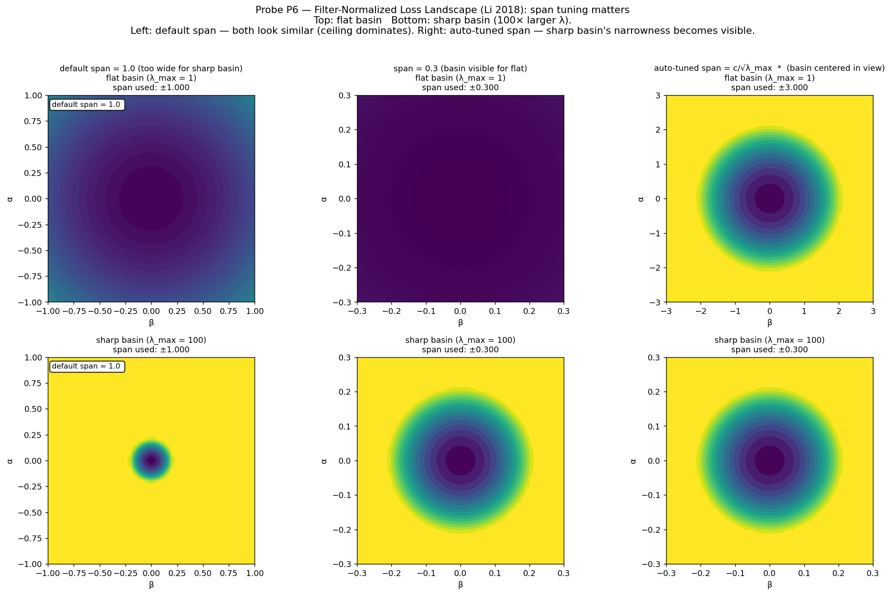

Six panels, organized as a 2D table:

- **Rows:** top = flat basin (λ_max = 1), bottom = sharp basin (λ_max = 100).
- **Columns:**
  - **Left (span = 1.0):** The flat basin fills the frame; the sharp basin appears as a tiny dot in the middle surrounded by saturated loss ceiling — barely visible.
  - **Middle (span = 0.3):** Sharp basin starts to show; flat basin now looks tighter than it is.
  - **Right (auto-tuned span ≈ 3/√λ_max):** **Each basin is centred at the same relative scale**. Now you can actually see they're different curvatures, but the **absolute** distance scale differs between rows.

This is the central P6 problem we identified after Exp 2: with `span = 1.0` (our default), the sharp bs=5000 basin fits inside a single grid cell, and the contour plot is dominated by the saturation ceiling far from the basin. **Numerically, we measured a 95× λ_max ratio (P5). Visually, the two P6 contours looked nearly identical.** P6 isn't broken; it's mis-magnified.

### Why P6 is visualization, not measurement

In a parameter space of dimension `N ≈ 10⁵`, two random Gaussian directions span a 2D plane. The probability that this plane contains the top Hessian eigenvector (the *worst-case* curvature direction) is essentially zero. The contour plot shows **average** curvature across an arbitrary 2D slice, while P5's λ_max measures the **worst-case** curvature across all of R^N. The two answers differ by a lot when the spectrum is anisotropic, as it is in trained networks.

### The fix (Side fix C in our backlog)

Three changes, ranked by impact:

1. **Auto-tune span**: `span = c / √λ_max` (where `c ≈ 3-5`), using the P5 eigenvalue we already compute. Without this, default-span P6 plots are useless on sharp models.
2. **Project along the top eigenvector**: use `d1 = v_max` from P5 instead of random, and `d2` random perpendicular. This visualizes the worst-case slice, matching what λ_max actually measures.
3. **Log-scale contours**: `matplotlib.colors.LogNorm()` reveals basin structure that linear contours flatten.

---

## 7. P7 — Linear Interpolation Between Checkpoints

**Equation:** Given two trained models with parameters `θ_A` and `θ_B`, evaluate the loss along the straight line connecting them:

```
θ(α) = (1 − α) · θ_A + α · θ_B,    α ∈ [0, 1]
L_interp[i] = L( θ(α_i) )
```

### The picture

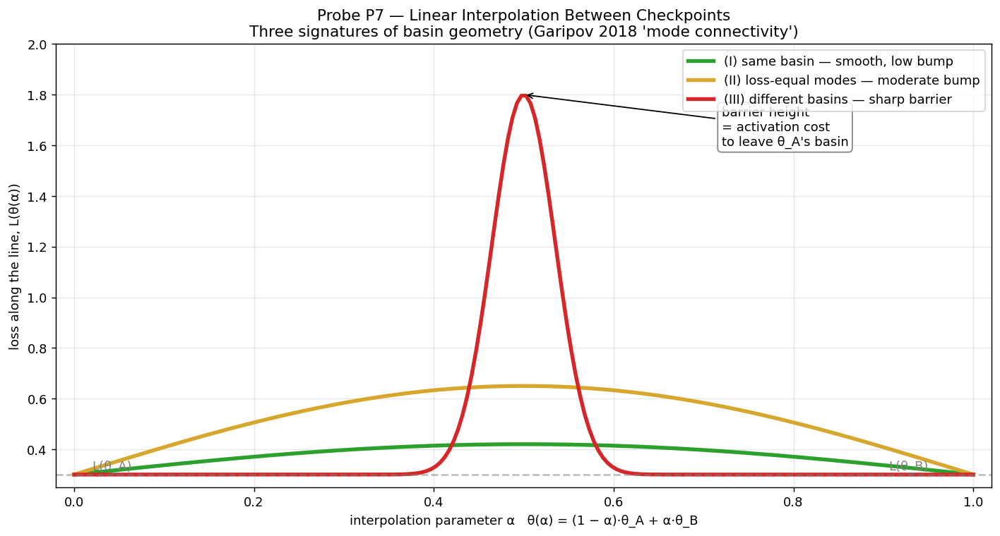

Three signatures:

| Curve | What it means |
|---|---|
| **(I) Green** — smooth, low-bump curve | Two endpoints sit in the **same basin**. Loss only rises slightly along the line. |
| **(II) Yellow** — moderate symmetric bump | "Loss-equal modes": both endpoints have low loss, but the line passes through higher-loss territory. They're connected through a wider basin, not isolated. |
| **(III) Red** — sharp barrier | Two **different basins entirely**. The line crosses a high-loss ridge. |

The barrier height is the *activation cost* to move from one minimum to the other in a straight line. This is the heart of **mode connectivity** (Garipov 2018) — empirically, modern networks have many low-loss basins connected by *curved* low-loss paths, but the linear interpolation between two arbitrary modes typically goes over a barrier.

### When P7 gives clean signal

- Comparing two models with the **same hyperparameters, different seeds**: usually signature (I) or (II) — modes are in the same effective basin.
- Comparing models with **different recipes**: signature (III) is common — the recipes converged to qualitatively different minima.

### When P7 is the wrong tool

- For brittleness directly. P7 tells you about parameter-space connectivity, not boundary geometry in input space.

### What we'd use it for

We haven't run P7 yet on our experiments. The natural use is comparing the bs=256 and bs=5000 checkpoints from Exp 2 — does going from a flat basin to a sharp basin go through a barrier, or down a smooth slope? Either answer would be informative.

---

## 8. P8 — Calibration / Expected Calibration Error

**Equation:** Bin samples by their maximum-softmax confidence into `B` bins. For each bin `b`:

```
avg_confidence_b = mean( max softmax probability  for samples in bin b )
avg_accuracy_b  = mean( prediction is correct      for samples in bin b )
```

The **Expected Calibration Error** is the size-weighted miscalibration:

```
ECE = Σ_b (n_b / N) · | avg_confidence_b − avg_accuracy_b |
```

A perfectly calibrated model has `avg_confidence_b = avg_accuracy_b` in every bin → ECE = 0.

### The picture

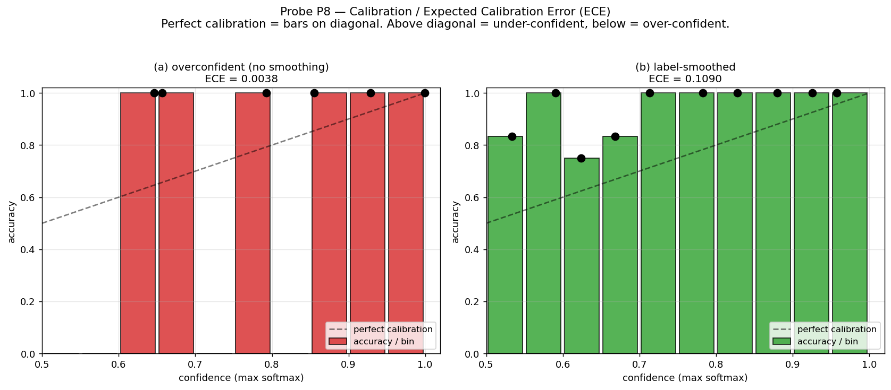

- **(a)** Overconfident model (no label smoothing). All confidences pile up near 1.0 (rightmost bins). Bars track close to the diagonal because the model is *almost* always right when very confident — ECE is low (0.004), but only because the confidence is overwhelmingly concentrated.
- **(b)** Label-smoothed model. Bars sit *above* the diagonal — the model is **under-confident**: when it says "60%" it's actually right 83% of the time. ECE is higher (0.109) because label smoothing caps the max softmax value by construction.

### What ECE is *and isn't*

ECE measures **probability calibration**: does the model's confidence match its reliability? This matters in production (downstream logic, expected-cost decisions, abstention).

ECE does **not** measure brittleness. From our Exp 1 brittleness demo:

| Recipe | ECE | robust @ ε=0.2 |
|---|---:|---:|
| brittle | 0.006 | 43.2 % |
| smooth | 0.109 | 58.2 % |

The brittle model is *better* calibrated but *worse* on adversarial robustness. ECE and brittleness can anti-correlate.

### When P8 gives clean signal

- Choosing models for production where confidence is consumed as a number.
- Detecting label-smoothing artifacts (high ECE in the under-confident direction).

### When P8 is the wrong tool

- As a brittleness proxy. Use P3.
- Comparing calibration across very different model sizes or training set sizes — these systematically shift confidence distributions.

---

## 9. Cross-Probe Agreement

The most important insight in this document.

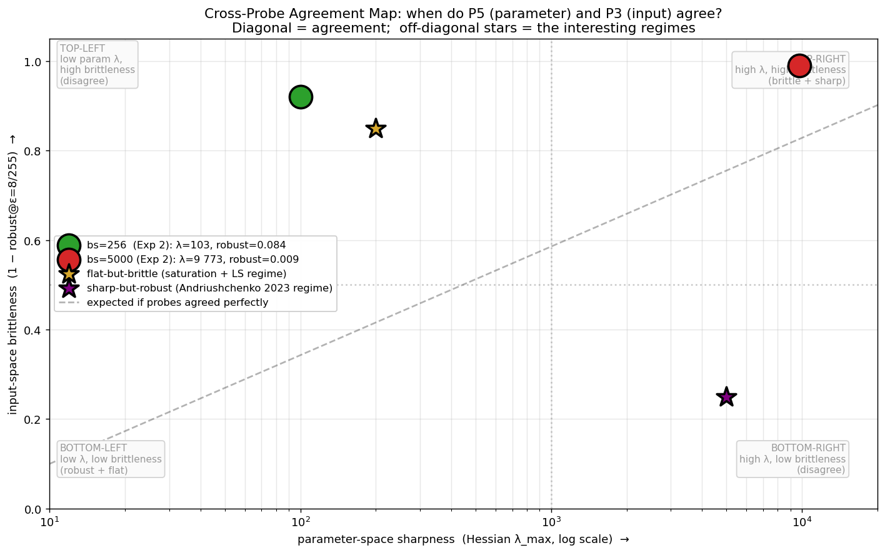

The two **gold-standard** probes — P5 (parameter-space) and P3 (input-space) — sit on the two axes of this plot. Each point is one trained model.

- **Filled circles** are real Exp 2 measurements. bs=256 sits bottom-left (flat + robust); bs=5000 sits top-right (sharp + brittle). Both lie close to the dashed diagonal "expected agreement" line.
- **Stars** are *interesting* regimes our playground has not yet visited:
  - **Top-left** (yellow star): low λ_max, high brittleness. Possible with saturated softmax + label smoothing — flat in parameter space but brittle in input space.
  - **Bottom-right** (purple star): high λ_max, low brittleness. The **Andriushchenko 2023** regime — they show this empirically across many architectures, with the cross-probe correlation only `r ≈ 0.3`.

### Why probes can disagree

The link chain:

```
H_param  ←→  ‖W‖  ←→  ‖∂f/∂x‖  ←→  ε_flip
└── strong link ─┘└── empirical link ─┘
```

The **first link** (parameter-space curvature ↔ weight norm) is a fact about how SGD reaches sharp minima — sharp basins are typically reached with aggressive updates, which grow weights. The **second link** (weight norm ↔ input-output Jacobian ↔ flip distance) is what makes input space brittleness scale with weight norms.

Both links can be broken:

| Broken link | Cause | Result |
|---|---|---|
| Reparameterization (Dinh 2017) | Rescale layers inverse-symmetrically | Function unchanged, λ_max changes arbitrarily |
| Adversarial training (Madry 2018) | Optimizer explicitly minimizes worst-case loss in input space | Can land in input-robust models with non-trivial λ_max |
| Label smoothing (Müller 2019) | Caps logit gap → caps weight magnitudes | Reduces ‖∂f/∂x‖ even when λ_max is unchanged |

### What disagreement *means*

When two probes agree, you have a high-confidence finding (Exp 2: both said bs=5000 is sharper/more brittle, p = 0.0008).

When two probes **disagree**, this is **research signal**, not noise. It tells you which mechanism (the param/input link) is being broken by some dial. The Andriushchenko 2023 paper is essentially a catalogue of disagreement cases.

This is the entire purpose of `notebooks/05_cross_probe_agreement.ipynb`: build the plot above for every experiment we run, and circle the off-diagonal points.

---

## 10. Decision Matrix — Which Probe for Which Question

| You want to know... | Probe(s) to use | Why |
|---|---|---|
| Is this model brittle in deployment? | **P3** (adversarial) | Operational threat-model answer |
| Is the parameter-space minimum sharp? | **P5** (Hessian) | Direct curvature measurement |
| How fragile is the boundary geometrically? | **P3 + P4** (when P4 is fixed) | Worst-case + typical-case |
| Is the model overconfident? | **P1 + P8** (margin + ECE) | Margin = logit confidence; ECE = calibration |
| Are two training runs in the same basin? | **P7** (linear interp) | Mode connectivity |
| Visualize the basin shape | **P6** (landscape) — but **tune span first** | Pretty pictures, easy to misread |

### Probe status table

| Probe | Status | Action needed |
|---|---|---|
| P1 Margin | ✓ working | Interpret carefully — see §1 |
| P2 Input-grad | ⚠ partial | Side fix E: use margin-grad to fix softmax saturation |
| P3 Adversarial | ✓ gold standard | None |
| P4 Boundary thickness | ✗ broken on CIFAR | Side fix A: batched implementation |
| P5 Hessian top-k | ✓ gold standard | None |
| P6 Landscape | ⚠ vis broken at default span | Side fix C: auto-tune span, log contours, eigenvector projection |
| P7 Linear interp | ✓ working | Underused — try on Exp 2 pairs |
| P8 Calibration | ✓ working | Not a brittleness probe |

---

## 11. The Math Cheat-Sheet (one-page summary)

```
P1  margin              m(x, y) = f(x)_y − max_{j≠y} f(x)_j

P2  input-grad norm     g(x, y) = ‖∇_x ℓ(f(x), y)‖_2
                        WARNING: saturates when softmax is one-hot

P3  adversarial         δ* = argmax_{‖δ‖_∞ ≤ ε} ℓ(f(x+δ), y)
    FGSM                δ_F = ε · sign(∇_x ℓ)                       (1 step)
    PGD-k               δ_(t+1) = clip(δ_t + α·sign(∇_x ℓ), [-ε,ε])  (k steps)

P4  boundary thickness  t*_i(x) = min { t > 0 : argmax f(x+t·d_i) ≠ y_pred }
                        thickness(x) = mean over directions of  min(t*_i, cap)

P5  Hessian top-k       H_{ij} = ∂²L/(∂θ_i ∂θ_j) at θ*
                        H·v = ∇_θ((∇_θ L)·v)   — Pearlmutter
                        eigsh(LinearOperator(matvec=H·v), k=5, which="LA")

P6  landscape slice     L_grid[i,j] = L(θ* + α_i·d1 + β_j·d2)
                        d1, d2 filter-normalized random directions
                        span should be ~ c/√λ_max, NOT default 1.0

P7  linear interp       θ(α) = (1−α)·θ_A + α·θ_B
                        L_curve[i] = L(θ(α_i))   for α ∈ [0, 1]

P8  ECE                 ECE = Σ_b (n_b/N) · | avg_conf_b − avg_acc_b |
```

---

## 12. References (one paper per probe)

Full citations in `docs/REFERENCES.bib`.

| Probe | Paper |
|---|---|
| P1 | (no single source — standard ML diagnostic) |
| P2 | (implicit in adversarial robustness literature) |
| P3 | Goodfellow 2015 (FGSM) + Madry 2018 (PGD) |
| P4 | Yang 2020 "Boundary thickness and robustness" (NeurIPS) |
| P5 | Pearlmutter 1994 (HVP) + Keskar 2017 (gen-gap connection) |
| P6 | Li 2018 "Visualizing the Loss Landscape of Neural Nets" (NeurIPS) |
| P7 | Garipov 2018 "Loss Surfaces, Mode Connectivity, and Fast Ensembling" (NeurIPS) |
| P8 | Guo 2017 "On Calibration of Modern Neural Networks" (ICML) |

Critique papers that motivate the cross-probe disagreement story:
- Dinh 2017 — "Sharp Minima Can Generalize For Deep Nets" (reparameterization)
- Andriushchenko 2023 — "A Modern Look at the Relationship Between Sharpness and Generalization"
- Jacot 2018 — NTK regime collapses the noise story
