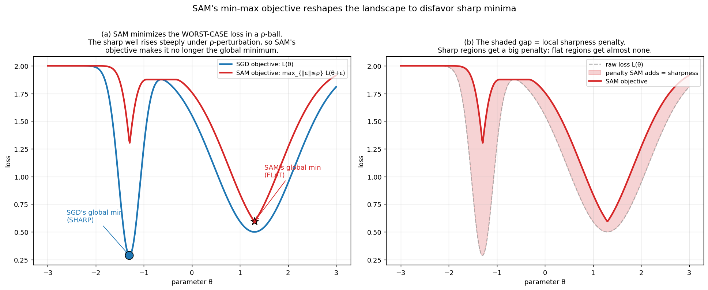
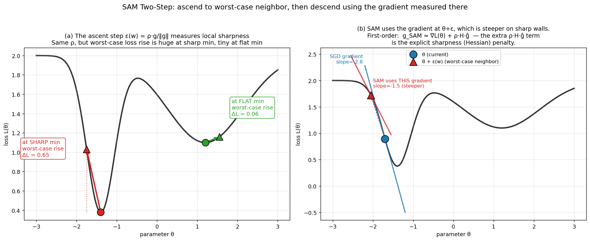
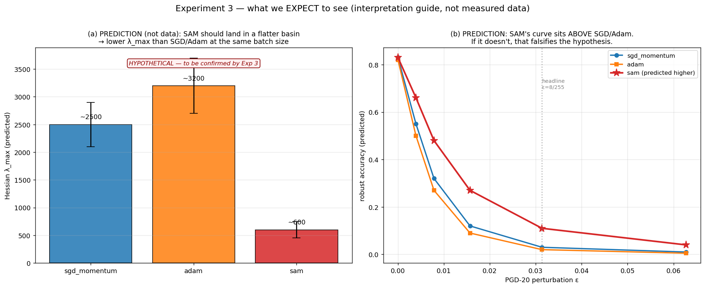

# SAM — Sharpness-Aware Minimization: Theory & How to Read Experiment 3

A pre-experiment briefing for **Experiment 3** of the Decision Boundary Playground. By the end you should understand: what Foret et al. tried, *why* it should work, how it connects to the batch-size story we already established (Exp 1 + Exp 2), and exactly how to interpret every number and figure Experiment 3 will produce — including what would *falsify* our hypothesis.

**Companion documents:**
- `docs/THEORY.md` — the SGD-noise → flatness → brittleness causal chain (read this first if you haven't).
- `docs/PROBES_THEORY.md` — what each probe measures, with pictures.
- `docs/PAPERS.md` — the canonical paper grounding each dial.
- `docs/runlog/2026-05-14.md` — Exp 1 (falsified) and Exp 2 (Keskar reproduced).

Paper: **Foret, Kleiner, Mobahi, Neyshabur — "Sharpness-Aware Minimization for Efficiently Improving Generalization" (ICLR 2021).**

---

## 1. The problem Foret was solving

By 2020 the field had two facts that didn't fit together:

1. **Sharp minima generalize worse** (Keskar 2017 — which we reproduced in Exp 2: bs=5000 had λ_max = 9 773 and a 4.7-point worse test accuracy than bs=256's λ_max = 103).
2. **But standard training (SGD/Adam) only minimizes the training loss `L(θ)`** — it has *no term* that says "and also be flat." It finds flatness only as an *accident* of small-batch gradient noise (the mechanism in `THEORY.md`).

So flatness was understood to be good, but we were getting it by luck (small batch → high SGD temperature → escapes sharp wells). Foret's question:

> **Can we make flatness an explicit training objective, so we get it on purpose — even at large batch size where the noise mechanism is weak?**

This is the crucial framing for our experiment. Exp 2 got flatness *via small batch*. Exp 3 asks whether SAM can get flatness *via the optimizer*, decoupled from batch size.

---

## 2. The objective: minimize the worst case in a neighborhood

Standard training:

```
min_θ  L(θ)                    # minimize loss at the single point θ
```

SAM instead minimizes the **worst loss in a small ball around θ**:

```
min_θ  max_{‖ε‖₂ ≤ ρ}  L(θ + ε)
```

Read it aloud: *"Find weights θ such that even the worst nearby weights (within radius ρ) still have low loss."* This is a **min-max** (robust optimization) objective. ρ is the neighborhood radius — a hyperparameter, default 0.05.

### Why this prefers flat minima



- **Panel (a)**: The blue curve is the raw loss `L(θ)` — its global minimum is the *sharp* well on the left. The red curve is the SAM objective `max_{‖ε‖≤ρ} L(θ+ε)`. Because the sharp well rises so steeply, perturbing θ by ρ inside it produces a *huge* loss — so the SAM objective *lifts* the sharp well. Under the SAM objective, the **flat** well becomes the global minimum.
- **Panel (b)**: The shaded area is exactly `SAM_objective − raw_loss` — the **sharpness penalty** SAM adds at every point. Sharp regions get a big penalty; flat regions get almost none. SAM is, in effect, `loss + (a penalty proportional to local sharpness)`.

This is the whole idea: **reshape the landscape so that sharp minima are no longer minima of the objective you optimize.**

---

## 3. How SAM is computed — the two-step approximation

The inner `max` is itself an optimization, which would be expensive to solve exactly. Foret approximate it with a **single gradient ascent step**. For a current θ with gradient `g = ∇L(θ)`, the worst-case perturbation is approximately:

```
ε*(θ) ≈ ρ · g / ‖g‖₂
```

(Move ρ in the unit-gradient direction — the direction of steepest loss increase.) Then SAM updates θ using the gradient computed **at the perturbed point** `θ + ε*`:

```
g_SAM = ∇L(θ + ε*(θ))
θ ← θ − lr · g_SAM        (via the base optimizer, e.g. SGD-momentum)
```

So each SAM step is **two forward-backward passes**: one to find `ε*` (the "ascent"), one to compute the update gradient at the ascended point (the "descent"). This is why **SAM costs ~2× per step**.

### Our implementation (matches the paper exactly)

In `playground/train/optimizers.py`, the `SAM` class:

```python
@torch.no_grad()
def first_step(self):                       # ASCENT
    grad_norm = self._grad_norm()
    for p in params:
        e_w = p.grad * (rho / (grad_norm + 1e-12))   # ε* = ρ·g/‖g‖
        p.add_(e_w)                                  # θ ← θ + ε*
        self.state[p]["e_w"] = e_w

@torch.no_grad()
def second_step(self):                      # DESCENT
    for p in params:
        p.sub_(self.state[p]["e_w"])         # restore θ (undo the ascent)
    self.base_optimizer.step()              # apply base-optimizer update
                                            # using grad measured at θ+ε*
```

And in `playground/train/trainer.py`, the training loop calls them around two backward passes:

```python
loss = criterion(model(x), y); loss.backward()
optimizer.first_step()                       # ascend to θ+ε*
criterion(model(x), y).backward()            # gradient AT θ+ε*
optimizer.second_step()                      # restore + update
```

### The picture



- **Panel (a)** — *why the ascent step measures sharpness*. The ascent moves the *same* distance ρ at both minima. But at the **sharp** minimum the worst-case loss rises by ΔL = 0.65, while at the **flat** minimum it rises by only ΔL = 0.06. The ascent step magnitude is fixed, but the *loss it reaches* encodes how sharp the local geometry is. SAM's update implicitly responds to this.
- **Panel (b)** — *what the descent uses*. SAM does **not** use the gradient at the current θ (blue tangent). It uses the gradient at the ascended point θ+ε* (red tangent), which is **steeper on sharp walls**. The first-order Taylor expansion makes this exact:

```
g_SAM = ∇L(θ + ρ·ĝ) ≈ ∇L(θ) + ρ · H · ĝ
                       └─ raw ─┘  └─ curvature penalty ─┘
```

where `H` is the Hessian and `ĝ = g/‖g‖`. **The extra `ρ·H·ĝ` term is an explicit sharpness penalty** — it's large exactly where curvature (the thing P5 measures!) is large. SAM is gradient descent with a built-in anti-sharpness force proportional to the Hessian.

---

## 4. How SAM connects to our existing theory

`THEORY.md` established this chain for *batch size*:

```
small batch → high SGD noise → high effective temperature → escapes sharp wells → flat minimum
```

SAM reaches the same destination (flat minimum) by a **completely different road**:

```
SAM objective → explicit ρ·H·ĝ penalty → actively repelled from sharp wells → flat minimum
```

| | Mechanism | Depends on batch size? | Cost |
|---|---|---|---|
| **Small-batch (Exp 2)** | Stochastic — noise jiggles you out of sharp wells | **Yes** — large batch kills the noise | 1× |
| **SAM (Exp 3)** | Deterministic — curvature penalty pushes you out | **No** — works at any batch size | ~2× |

**This is the experimental crux.** If SAM works as advertised, it should produce a low Hessian λ_max *even at a batch size large enough that the noise mechanism is weak*. That's why Exp 3 fixes `batch_size = 1024` (large enough that vanilla SGD would tend toward a sharper minimum) and varies only the optimizer.

---

## 5. Experiment 3 — design

```yaml
# configs/exp_optimizer_sam.yaml
experiment_name: optimizer_sam
base:
  model: small_cnn          # same as Exp 2 — comparable to the Keskar baseline
  dataset: cifar10
  lr: 0.05
  momentum: 0.9
  weight_decay: 5e-4
  lr_schedule: cosine
  batch_size: 1024          # FIXED — large enough that noise-flatness is weak
  epochs: 100
  sam_rho: 0.05             # Foret's default neighborhood radius
sweep:
  optimizer: [sgd_momentum, adam, sam]   # THE ONE DIAL WE VARY
  seed: [0, 1, 2]                        # 3 seeds for significance
deep_probe_runs:
  - {optimizer: sgd_momentum, seed: 0}   # Hessian + landscape on baseline
  - {optimizer: sam, seed: 0}            # Hessian + landscape on SAM
```

9 runs (3 optimizers × 3 seeds). Deep probes (Hessian λ_max + landscape) on one SGD and one SAM run. Estimated ~60 min on the A10 (SAM's 2× cost is offset by bs=1024 being fast).

### The hypothesis (for the runlog)

> At fixed batch_size=1024 and 100 epochs, switching the optimizer to SAM (ρ=0.05) yields **≥30% lower Hessian λ_max** and **≥3 pts higher PGD-20 robust accuracy** than the SGD/Adam baselines, with **clean accuracy within ±1 pt** (Foret 2021).
>
> **Falsified if:** the λ_max ratio (SGD/SAM) < 1.2×, OR the robust-accuracy improvement < 1 pt.

---

## 6. How to interpret the results — probe by probe

This is the part to keep open while reading the output. For each probe, what to look at and what it would mean.

### P5 — Hessian λ_max (the headline parameter-space test)

- **What to look at:** `λ_max(sam)` vs `λ_max(sgd_momentum)` on the deep-probe cells.
- **SAM-works signature:** SAM's λ_max is substantially lower (we predicted ≥30%, ideally 2-5× lower).
- **Why it's the headline:** SAM's whole claim is "flatter minimum." λ_max is the direct measurement of flatness. This is the cleanest confirmation-or-refutation.
- **Gotcha:** λ_max must be compared at *similar loss / clean accuracy*. If SAM badly underfit (low clean acc), its low λ_max could be underfitting, not flatness — check clean accuracy first.

### P3 — PGD-20 robust accuracy (the headline input-space test)

- **What to look at:** the accuracy-vs-ε curves; specifically robust acc @ ε=8/255.
- **SAM-works signature:** SAM's curve sits **above** SGD's and Adam's at every ε > 0.
- **Why it matters:** this is the *operational* payoff. Flatness in parameter space is only interesting if it buys real input-space robustness. P3 closes that loop.
- **Compare via fragility ratio** `(clean − robust)/clean` if clean accuracies differ across optimizers (they shouldn't by much, but check).

### Cross-probe agreement (P5 vs P3)

- **The interesting question:** do P5 (flatter) and P3 (more robust) **agree** for SAM?
- If both improve → strong, coherent story: SAM flattens the basin *and* that flatness transfers to input-space robustness. Plot lands bottom-left in `figures/09_cross_probe.png`.
- If P5 improves but P3 doesn't → SAM flattened parameter space but it *didn't* transfer to input-space robustness. This would be the **Andriushchenko 2023 regime** — a genuinely publishable-flavored disagreement, and exactly what `notebooks/05_cross_probe_agreement.ipynb` exists to catch.

### P1 — Margin & P8 — Calibration (secondary)

- **Margin:** SAM tends to produce moderate margins (it's a regularizer). Don't expect margin to track robustness — Exp 1 and Exp 2 already showed margin is an unreliable brittleness probe.
- **ECE:** watch whether SAM changes calibration. Foret reported SAM often *improves* calibration as a side effect. Not a headline, but worth a note in "Surprises."

### What we EXPECT to see (interpretation guide, not data)



**These are mock-ups, not measurements** — drawn to calibrate your eye before the real data arrives. Panel (a): SAM's predicted λ_max bar should be visibly shorter than SGD and Adam. Panel (b): SAM's predicted PGD curve sits above the other two. If the *real* figure looks like this → hypothesis confirmed. If SAM's bar is as tall as SGD's, or its curve overlaps → hypothesis falsified, and we investigate why (ρ too small? not enough epochs? our SAM implementation buggy?).

---

## 7. Failure modes & confounds to watch

| Risk | Symptom | What to do |
|---|---|---|
| **ρ too small** | SAM ≈ SGD on every probe | ρ=0.05 is Foret's default for CIFAR; if null result, try ρ=0.1 before concluding SAM fails |
| **SAM underfits** | SAM clean acc ≪ SGD clean acc | SAM sometimes needs more epochs; check the training curve, consider 150 epochs |
| **2× cost confound** | SAM saw "half the optimizer steps" worth of base-updates | This is inherent to SAM and fair — we compare at equal *epochs*, which is the standard protocol |
| **Adam interaction** | Adam's adaptive LR muddies the comparison | We include Adam as a *baseline reference*, not the SAM base; our SAM wraps SGD-momentum, matching Foret |
| **Hessian at non-minimum** | λ_max noisy / negative eigenvalues | Only trust λ_max if the model converged (low train loss); check metrics.jsonl |
| **batch_size=1024 still mildly noisy** | SGD itself somewhat flat | 1024 is a deliberate middle ground — large enough to weaken noise-flatness, small enough to train well in 100 epochs. If SGD is already very flat, the SAM gap shrinks; note it. |

---

## 8. Why this experiment matters for the bigger picture

Exp 1 and Exp 2 established that **batch size controls sharpness via SGD noise** — but that's a *correlational* lever (you change batch size, sharpness changes, but batch size also changes many other things: gradient quality, training speed, generalization).

SAM is a **causal** intervention on sharpness specifically. It adds a term whose *only* job is to penalize sharpness, holding everything else fixed. If SAM moves the probes the way the theory predicts, we have evidence that **sharpness itself** — not some batch-size-correlated confound — drives the brittleness we measure.

And if SAM *doesn't* deliver input-space robustness despite flattening parameter space, that's the Andriushchenko 2023 result reproduced in our own playground — arguably the more interesting outcome, because it would mean parameter-space flatness is *not sufficient* for input-space robustness, and we'd want to know which dial *is*.

Either way, Exp 3 is a clean, one-dial, falsifiable test of the central mechanism. That's exactly the kind of experiment the playground was built for.

---

## 9. One-page summary

```
WHAT SAM DOES
  min_θ  max_{‖ε‖≤ρ} L(θ+ε)        # minimize worst-case loss in a ρ-ball

HOW IT'S COMPUTED (2 passes/step)
  ε* = ρ·g/‖g‖                      # ascent: find worst-case neighbor
  g_SAM = ∇L(θ + ε*)               # descent gradient measured THERE
  θ ← θ − lr·g_SAM
  first-order:  g_SAM ≈ ∇L(θ) + ρ·H·ĝ   ← the ρ·H·ĝ is the sharpness penalty

WHY IT FINDS FLAT MINIMA
  sharp wells rise steeply under ρ-perturbation → SAM objective lifts them
  → flat minimum becomes the global minimum of the objective

CONNECTION TO OUR THEORY
  small batch reaches flatness via NOISE (stochastic, batch-dependent)
  SAM reaches flatness via PENALTY (deterministic, batch-independent)

EXP 3 TEST
  fix batch_size=1024, vary optimizer ∈ {sgd_momentum, adam, sam}, 3 seeds
  HYPOTHESIS: SAM gives lower λ_max (P5) + higher robust acc (P3),
              equal clean acc
  FALSIFIED IF: λ_max ratio < 1.2×  OR  robust-acc gain < 1 pt

KEY PLOTS TO READ
  P5 λ_max bar       — is SAM's bar shorter? (parameter-space flatness)
  P3 ε-curve         — is SAM's curve higher? (input-space robustness)
  cross-probe scatter — do P5 and P3 agree for SAM?
```

---

## 10. References

Full citations in `docs/REFERENCES.bib`.

- **Foret, Kleiner, Mobahi, Neyshabur 2021** — SAM (the paper this doc is about).
- **Keskar 2017** — sharp minima generalize worse (Exp 2 reproduced this).
- **Andriushchenko, Croce, Müller, Hein, Flammarion 2023** — parameter-space sharpness only weakly predicts generalization (the disagreement regime to watch for).
- **Pearlmutter 1994** — Hessian-vector products (how P5 measures λ_max).
