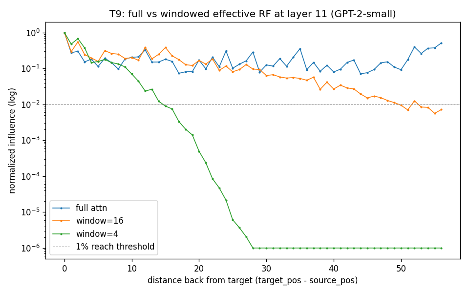

# Receptive-Field Playground — Progress Report

**As of:** 2026-06-23
**Scope of this report:** everything built and run so far — environment, the T0 probe rig, the T3 sanity gate, and the T9 flagship experiment (the project thesis, measured). Theory lives in `DESIGN.md`; paper map in `PAPERS.md`; raw per-run logs in `runlog/2026-06-23.md`. This file is the readable synthesis.

**Discipline:** paper-driven, one-dial-per-experiment, 9-field runlog.

---

## 1. What we're doing (one paragraph)

We are *measuring* the receptive field (RF) of attention — which input positions actually influence a given output unit, and how much. For a CNN the RF is fixed geometry; for attention it is **global in theory but learned/effective in practice**. The flagship question (the user's own observation, sharpened into a hypothesis): *sliding-window attention (SWA) tries to approximate full quadratic attention — does it, and where does it fail?* Answer below: it approximates the **effective** RF, and the residual error is the long-range tail.

---

## 2. Decisions locked (DESIGN.md §6)

| # | Decision | Choice | Why |
|---|----------|--------|-----|
| D1 | Model source | **GPT-2-small**, pretrained | real induction/sink heads available; no training needed for T0–T13 |
| D1′ | Tooling (amended) | **raw HuggingFace `transformers` + own hooks** | TransformerLens won't install on Python 3.14; HF already present; fits from-scratch-hooks ethos |
| D2 | Ruler | **A (attention weights) + D (gradient)** | A = cheap visual; D = causal ground truth; their gap is itself a finding (T1) |
| D3 | SWA isolation | **impose window mask at inference** (swap `attn.bias` buffer, restore) | same weights, mask is the only dial ⇒ clean ablation, no retrain confound |

**Consequence:** the entire Part-B critical path (T0→T13) runs with **zero training**. Only T12 (head emergence) will need a trainable net.

---

## 3. Environment

| Component | Status |
|-----------|--------|
| Python | 3.14.0 |
| torch | OK |
| transformers | OK (GPT-2-small loads in ~4s, cached) |
| numpy / matplotlib | OK |
| transformer_lens | MISSING (incompatible w/ Py3.14) → pivoted to HF |

GPT-2-small: 12 layers × 12 heads, d_model=768, ctx 1024. Loaded with `attn_implementation='eager'` so attention patterns are exposed. CPU only (fine at this scale).

---

## 4. T0 — the probe rig  (`src/rf_probe.py`)

The single function every node calls:

```python
attn_rf(model, input_ids, target_pos, *, layer, head=None, ruler=Ruler.GRAD, window=None) -> RFResult
```

Returns an immutable `RFResult` whose `.influence` is a length-`seq_len` vector: how much each source position influences the target.

### Ruler A — raw attention weights
Forward with `output_attentions=True`, take row `A[layer][head, target_pos, :]` (mean over heads if `head=None`). Cheap, visual, but **can lie** (a head can dump mass on BOS yet barely affect output — Kobayashi 2020). Used for visualization.

### Ruler D — gradient influence (causal ground truth)
Two choices *define what "RF" means here*; both committed:
1. **Backprop from:** the L2 norm of the **residual-stream vector at `(layer, target_pos)`** — the transformer twin of the CNN "single center unit" probe.
2. **Reduce by:** L2 norm over `d_model` of the input-embedding gradient → one number per position.

Mechanically: embed tokens (`wte`), `requires_grad_(True)`, forward via `inputs_embeds`, take `hidden_states[layer+1][0, target_pos]`, `.norm().backward()`, then `emb.grad[0].norm(dim=-1)`. Future/masked positions get **exactly 0** gradient (HF zeroes them pre-softmax), so causality is automatic.

### D3 window mechanism
GPT-2 stores its causal mask as a `(1,1,1024,1024)` bool buffer `attn.bias` per block. To impose a sliding window we intersect it with a band `(i − j) < window`, swap it into every block, run, and **restore in a `finally`**. Reversible, no retraining — exactly the D3 design.

---

## 5. T3 — sanity gate  (`experiments/t3_sanity.py`)  → **ALL PASS** (exit 0)

The rig must pass this before any node is trusted. Prompt: `"The cat sat on the mat"` (6 tokens).

| Check | What it verifies | Result |
|-------|------------------|--------|
| **C1 causality** | gradient RF gives ~0 influence to FUTURE positions | PASS — max future influence = **0.00e+00** (exact) |
| **C2 self-dominant** | target influences itself most | PASS — target norm = 1.000, max |
| **C3 window severs** | window=2 at layer 0 zeroes far positions full attn reaches | PASS — severed = 0.00e+00; full reaches them = 5.05 |

Gradient RF of `target_pos=3`, layer 0, full attention (normalized):
```
pos 0: 0.3047   pos 1: 0.2026   pos 2: 0.2106   pos 3: 1.0000 <-target   pos 4: 0.0000   pos 5: 0.0000
```
Note: layer-0 full-attn RF is fairly **flat** across past tokens (0.20–0.30) — residual mixing is near-uniform before heads specialize (to revisit at T5/T6).

---

## 6. T9 — FLAGSHIP: SWA as effective-RF approximation  (`experiments/t9_swa_erf.py`)

**Method.** 57-token prompt. Gradient RF (ruler D) of the **last token**, measured at layers {0, 3, 7, 11}, for full attention vs window=16 vs window=4. "Effective reach" = farthest distance back with influence > 1% of max. Compared to the theoretical reach `w·(L+1)` (the conv recurrence). Log-y influence-vs-distance plotted at layer 11.

### 6.1 Effective reach vs depth

| layer | full | win=16 | win=4 | theory w=16 | theory w=4 |
|------:|-----:|-------:|------:|------------:|-----------:|
| 0  | 56 | 15 | 3  | 16  | 4  |
| 3  | 56 | 32 | 8  | 64  | 16 |
| 7  | 56 | 54 | 13 | 128 | 32 |
| 11 | 56 | 52 | 14 | 192 | 48 |

- **Full attention:** reach = 56 (everything) at *every* layer — global RF, as expected.
- **window=4:** reach grows **3 → 8 → 13 → 14** with depth (monotonic). Depth buys reach.
- **window=16:** reach **15 → 32 → 54 → 52** — nearly recovers full reach by layer 7.

### 6.2 The figure



*Layer 11, normalized influence (log-y) vs distance back.* Blue (full) stays flat ~0.1–1.0 across all 56 positions. Orange (win=16) tracks full to ~dist 15, then gently decays, crossing the 1% line near dist 50. Green (win=4) decays steeply (log-linear) and hits the structural-zero floor (1e-6) by ~dist 28.

### 6.3 Findings

1. **Thesis confirmed — depth buys reach.** A 4-wide window reaches 14 tokens back by layer 11, purely from stacking windowed layers. This is the CNN receptive-field recurrence operating inside a transformer (DESIGN §3). SWA = transformer-pretending-to-be-a-CNN, *measured*.

2. **The twist — effective reach ≪ theoretical `w×L`.** Theory allows win=4 to reach 48 by layer 11; it reaches only **14 (~30%)**. Each hop attenuates (the green curve's steep decay), so reach grows **sublinearly and saturates**. This is exactly Luo 2016's "effective RF is a small central fraction of theoretical RF" — first shown for CNNs, now reproduced for **windowed attention**. `w×L` is an upper bound the network never cashes.

3. **Practical window-sizing rule, read straight off the curve.** win=16 recovers ~52/56 ≈ **93%** of the effective RF; win=4 recovers only ~14/56 ≈ **25%**. This is *why* real SWA models (Mistral, Longformer) use windows in the hundreds–thousands: small windows genuinely drop the long-range tail. The approximation error is the part of each curve below the dashed 1% line.

> **Sharpened thesis (the user's sentence, now measured):** sliding-window attention approximates full attention's **effective** receptive field — ~25% recovered at w=4, ~93% at w=16 — and the residual approximation error is exactly the long-range tail (the green curve dropping to the structural-zero floor).

---

## 7. Connection to the convolution half (DESIGN §1, §4)

The same equation governs both halves:

| | Convolution | Sliding-window attention |
|---|---|---|
| per-step reach | kernel `k` | window `w` |
| reach recurrence | `r_l = r_{l-1} + (k−1)` | `≈ w·L` (upper bound) |
| effective ≪ theoretical | √depth Gaussian (Luo 2016) | sublinear saturation (T9, this report) |

This makes the conv DAG (N5 depth, N8 dilation) not background but the literal model for T9 — and the spine of the eventual **T14 synthesis** (geometric vs learned RF, converging in the windowed case).

---

## 8. Artifact index

```
receptive-field-playground/
├── docs/
│   ├── DESIGN.md            theory (A/B/C) + both DAGs (N0–N14, T0–T14) + decisions §6
│   ├── PAPERS.md            16 primary papers mapped to nodes
│   ├── PROGRESS.md          <- this report
│   ├── figures/
│   │   └── t9_swa_erf.png   flagship plot
│   └── runlog/
│       ├── TEMPLATE.md      9-field per-run block
│       └── 2026-06-23.md    kickoff, decisions, T0+T3, T9 (full raw logs)
├── src/
│   └── rf_probe.py          T0 probe rig: attn_rf(), rulers A/D, window ablation
└── experiments/
    ├── t3_sanity.py         T3 gate (C1/C2/C3) — ALL PASS
    └── t9_swa_erf.py        T9 flagship — reach table + figure
```

## 9. Reproduce

```bash
cd receptive-field-playground
python experiments/t3_sanity.py     # gate: must print "T3 SANITY: ALL PASS"
python experiments/t9_swa_erf.py    # writes docs/figures/t9_swa_erf.png + reach table
```

---

## 10. Status & next steps

**Done:** T0 (rig) · T3 (sanity, PASS) · T9 (flagship, thesis confirmed + saturation twist).

**Open / queued:**
- **T11 — attention sinks** *(next)*: re-run win=4 but keep the first 1–2 tokens globally visible (StreamingLLM patch, Xiao 2023); predict the severed long-range tail partially returns.
- **Gap/error curve**: explicit `full − window` influence-by-distance to quantify the DESIGN §3 table.
- **Window sweep**: w ∈ {2,4,8,16,32,64} to map the reach-recovery curve finely.
- **T1 — A vs D**: show raw attention weights mislead vs the gradient ruler on the same token.
- **T5 — head taxonomy**: classify per-head RF (local / prev-token / sink / induction).

User to tweak any knob (window sizes, threshold, prompt, target layer) before the next drive.
